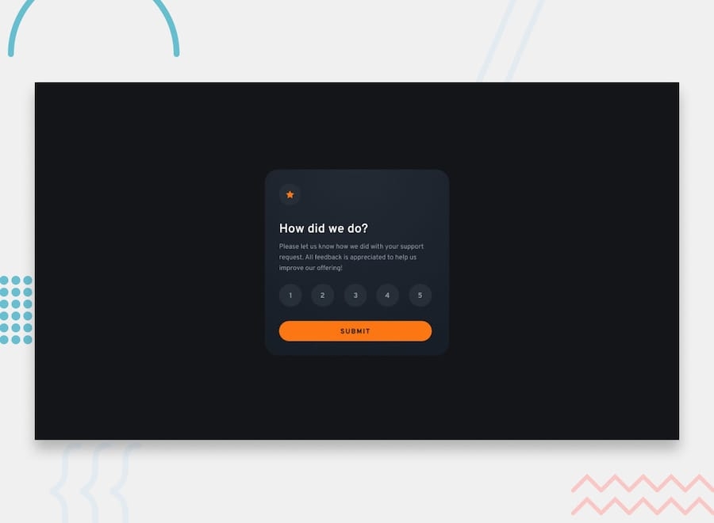

# Frontend Mentor - Interactive Rating Component

        

## Overview

[Frontend Mentor](https://www.frontendmentor.io) is a great platform to keep studying and practicing front-end development, letting you focus on the code itself without worrying about design or UI. It offers a wide variety of projects, from challenges that only require HTML and CSS to full-stack builds, spanning multiple difficulty levels from newbie to advanced.

This makes it easy to test out whatever you're currently studying — whether that's accessibility, Tailwind, TypeScript, or even React and Next.js — and you can make projects as complete and complex as you like, simulating APIs or databases along the way. It's a great playground to sharpen your skills, adaptable to whatever you need at the time.

### Live Demo

- [Live Demo](https://gasket-bamboo-flair.netlify.app)
- [Frontend Mentor Solution](https://www.frontendmentor.io/solutions/interactive-rating-component-ULxFOLNZtt)

## Frontend Mentor

[Frontend Mentor](https://www.frontendmentor.io) challenges help you improve your coding skills by building realistic projects.

The challenges are pretty straight forward, you have to replicate the page or element as closely as possible as the initial image or Figma layout - when provided.

### The Challenge

- [Interactive Rating Component](https://www.frontendmentor.io/challenges/interactive-rating-component-koxpeBUmI)

Your users should be able to:

- View the optimal layout for the section depending on their device's screen size

## Development Notes

### 3D Card Flip Animation

Since this is a pretty simple project, I've decided to add a bit of interactivity to it, so I can try new things and learn from it. The main feature is that when the user submits the form, the rating card will flip and show the thanks card, with the rating that the user selected.

I initially made the animation using a mix of `setTimeout` and `translateY` with precise timing so the animation would look smooth and natural. But with a bit of research and help from AI, I found out that there was a more complicated but more performant way to do this animation, so I gave it a try. To be honest, I don't completely understood all the inner workings, but it was an fun experiment and this is a modern way to do 3D animations, so I'm glad I learned it.

I also made in a way that when the user selects a rating, the numbers become filled with starts, which is a nice visual feedback for the user, and also makes it more clear which rating they have selected.

### Accessibility and Semantic HTML

To ensure proper validation, 100% of the visible content is wrapped inside appropriate HTML5 landmark elements, and the form structure uses proper semantic nodes for selection:

- Form Structure: Wrapped the rating options within a and for native screen reader support.
- Radio Inputs: Each rating option is implemented as a radio input, allowing users to select only one rating at a time, with clear labels for screen readers.

### Architecture and Tooling

- TypeScript: Adopted to enforce type safety, cleaner logic separation, and robust IDE autocompletion.
- BEM (Block Element Modifier): Applied to build predictable and modular stylesheets.

## Built With

- Markup: HTML5, Semantic Elements
- Styling: CSS3 (Grid, Flexbox, Fluid Spacing using clamp()), BEM Architecture
- Logic & Tooling: TypeScript, Vite, Bun

## Author

[@psudo-dev](https://github.com/psudo-dev)

## License

This project is licensed under the MIT License - see the [LICENSE.md](./LICENSE.md) file for details
